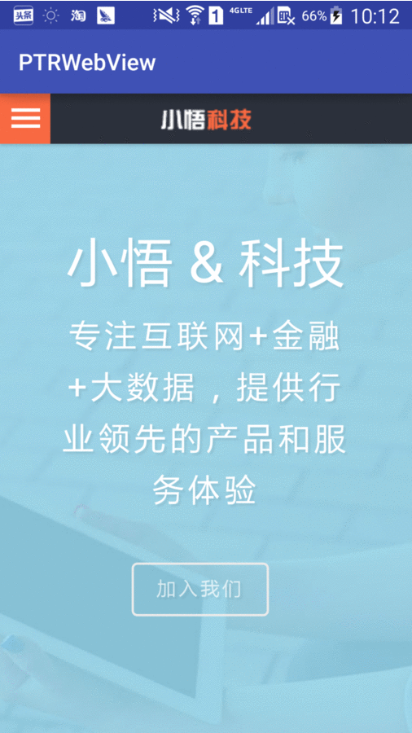

pull-to-refresh WebView
===

Allow your WebView pull-to-refresh in Android.

## Overview
Here is an example:




## Setup

#### Gradle (Android Studio)

Insert the following dependency to `build.gradle` file of your project.

```groovy
dependencies {
    compile 'com.microwu.ptrwebviewlibray:ptrwebview:1.0.0'
}
```

Note that Maven central repository should be defined eg. in top-level `build.gradle` like this:

```groovy 
buildscript {
    repositories {
        mavenCentral()
    }
}

allprojects {
    repositories {
        mavenCentral()
    }
}
```

#### Maven dependency

```groovy
<dependency>
  <groupId>com.microwu.ptrwebviewlibray</groupId>
  <artifactId>ptrwebview</artifactId>
  <version>1.0.0</version>
  <type>pom</type>
</dependency>
```

## Usage

### [Sample project](https://github.com/lipeng1667/PullToRefreshWebView/tree/master/SimpleDemo)
Sample project is under construction. Not all features are covered yet.

===

Just <font color=red size=4>**TWO**</font> simple steps to create a WebView who can pull-to-refresh.

1. Container in XML file
	Just create an empty `RelativeLayout` in your activity or view's layout.xml as container. 
	
	```xml
	<?xml version="1.0" encoding="utf-8"?>
	<RelativeLayout xmlns:android="http://schemas.android.com/apk/res/android"
    android:layout_width="match_parent"
    android:layout_height="match_parent">

    <RelativeLayout
        android:id="@+id/web_view_container"
        android:layout_width="match_parent"
        android:layout_height="match_parent"/>
        
	</RelativeLayout>
	``` 

2. Init an instance
	Create the instance of `PullToRefreshWebView` and add it into the `web_view_container` you created in the first step.
	
	```java
	@Override
    protected void onCreate(Bundle savedInstanceState) {
        super.onCreate(savedInstanceState);
        setContentView(R.layout.activity_main);
        
        // NEW THE INSTANCE
        PullToRefreshWebView ptr_web_view_ = new PullToRefreshWebView(this,null);
        RelativeLayout container = (RelativeLayout) findViewById(R.id.web_view_container);
        container.addView(ptr_web_view_);
        ptr_web_view_.loadUrl("http://www.microwu.com");
    }
	```

	**Note:**
	`PullToRefreshWebView(Context aContext, AttributeSet attrs)` is the constructor method to create an instance, `aContext` is current activity's context, `attrs` is for webview's attributesSet, you can leave it as `null`.
	
### Methods
There are several methods:

##### From 1.0.0
 
+ loadUrl(String url) - let webView load the url
+ canGoBack() - return webView can go back or not
+ goback() - if canGoBack() return true, you can invoke this to go back.


## 中文源码解析

关于源码的中文讲解，请参见[这里](http://lipeng1667.github.io/2016/09/12/android-webview-pull-to-refresh/)


